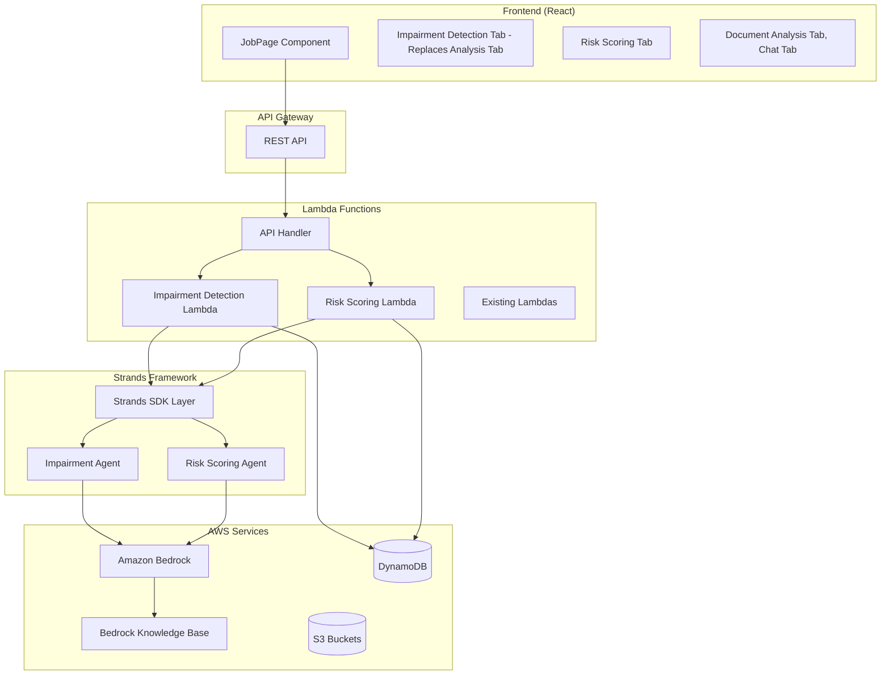
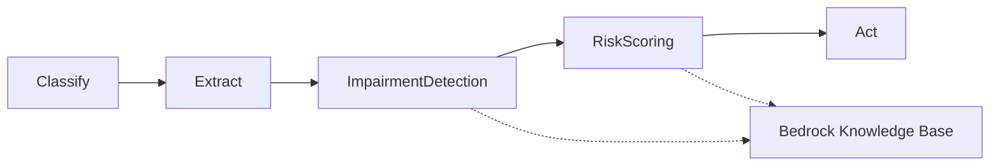

# Design Document

## Overview

The agentic underwriting feature will extend the existing underwriting application by adding two specialized AI agents: an impairment detection agent and a risk scoring agent. These agents will be built using the Strands agents framework and will leverage a new Bedrock knowledge base populated with an underwriting manual. The design integrates seamlessly with the existing Step Functions workflow while adding new UI tabs and Lambda functions to support the agentic capabilities.

**Reference Implementation**: The agent implementations are based on the provided notebooks:
- **Impairment Detection Agent**: `.kiro/specs/agentic-underwriting/detect_agent_workstream3.ipynb`
- **Risk Scoring Agent**: `.kiro/specs/agentic-underwriting/scoring_agent_workstream4.ipynb`

## Architecture

### High-Level Architecture

The agentic underwriting feature will extend the existing architecture with the following components:



### Integration with Existing Workflow

The agentic features will replace and enhance the existing analysis step in the Step Functions workflow:



**Key Changes**:
- Replace the existing "Analyze" step with "ImpairmentDetection" step
- Add new "RiskScoring" step that uses impairment detection results
- Both agents leverage the Bedrock knowledge base for enhanced accuracy

## Components and Interfaces

### Frontend Components

#### 1. Enhanced JobPage Component
- **Purpose**: Replace existing analysis tab with impairment detection tab and add risk scoring tab
- **Tab Changes**: 
  - Replace "Underwriter Analysis" tab with "Impairment Detection" tab
  - Add new "Risk Scoring" tab
  - Keep existing "Document Analysis" and "Chat" tabs
- **New State**:
  - `impairmentResults: ImpairmentResult[]`
  - `riskScoreData: RiskScoreData`
  - `agentProcessingStatus: AgentStatus`

#### 2. ImpairmentDetectionTab Component (Replaces UnderwriterAnalysisTab)
- **Purpose**: Replace the existing underwriter analysis tab with specialized impairment detection
- **Features**:
  - Real-time processing status
  - Categorized impairment list with severity indicators
  - Page references with navigation links
  - Manual override capabilities
  - Enhanced medical terminology recognition
- **Interface**:
```typescript
interface ImpairmentResult {
  impairment_id: string;
  scoring_factors: Record<string, any>;
  evidence: string[];
  discrepancies?: string[];
}

// Example from notebook:
// {
//   "impairment_id": "hypertension",
//   "scoring_factors": {
//     "blood_pressure": "128/92 mmHg",
//     "age": 41,
//     "medication": "Lisinopril 10mg",
//     "duration": "At least since 2022-04-18",
//     "compliance": "Good - regular refills",
//     "target_organ_damage": "None evident",
//     "comorbidities": "None evident",
//     "family_history": "Father had heart attack at age 58"
//   },
//   "evidence": [
//     "Rx: Lisinopril 10mg for hypertension, filled 2024-01-10 (90 tablets)",
//     "MIB: Code 311C 'CARDIOVASCULAR - HYPERTENSION TREATED' from 2022-04-18",
//     "Application: Blood pressure reading 128/92 mmHg"
//   ]
// }
```

#### 3. RiskScoringTab Component
- **Purpose**: Display risk scoring results and breakdown
- **Features**:
  - Overall risk score with visual indicators
  - Risk factor breakdown by category
  - Confidence intervals and reasoning
  - Recommendation display
- **Interface**:
```typescript
interface RiskScoreData {
  total_score: number;
  impairment_scores: ImpairmentScore[];
}

interface ImpairmentScore {
  impairment_id: string;
  sub_total: number;
  reason: string;
}

// Example from notebook:
// {
//   "total_score": 25,
//   "impairment_scores": [
//     {
//       "impairment_id": "hypertension",
//       "sub_total": 25,
//       "reason": "Blood pressure of 128/92 mmHg at age 41 falls within the '141-150/91-95' range for the 'Age 40-60' column, which indicates a debit between 0 to +25. Applied the lower value of 0. Added +25 points for family history of early cardiovascular disease."
//     }
//   ]
// }
```

### Backend Components

#### 1. Impairment Detection Lambda
- **Function Name**: `ai-underwriting-impairment-detection`
- **Runtime**: Python 3.12
- **Memory**: 2048 MB
- **Timeout**: 10 minutes
- **Layers**: Strands SDK Layer, Boto3 Layer
- **Environment Variables**:
  - `KNOWLEDGE_BASE_ID`: Bedrock knowledge base identifier (e.g., 'YSWIGPQHRJ')
  - `BEDROCK_MODEL_ID`: `us.anthropic.claude-3-7-sonnet-20250219-v1:0`
  - `EMBEDDING_MODEL_ID`: `amazon.titan-embed-text-v2:0`
  - `JOBS_TABLE_NAME`: DynamoDB table name
- **Key Features**:
  - Processes XML feeds (application, Rx, labs, MIB) to identify impairments
  - Uses Strands agent framework with custom tools (`scratch_fixed`, `kb_search`)
  - Queries Bedrock knowledge base for scoring factors
  - Returns structured JSON with impairments, scoring factors, and evidence

#### 2. Risk Scoring Lambda
- **Function Name**: `ai-underwriting-risk-scoring`
- **Runtime**: Python 3.12
- **Memory**: 1024 MB
- **Timeout**: 5 minutes
- **Layers**: Strands SDK Layer, Boto3 Layer
- **Environment Variables**:
  - `KNOWLEDGE_BASE_ID`: Bedrock knowledge base identifier (e.g., 'YSWIGPQHRJ')
  - `BEDROCK_MODEL_ID`: `us.anthropic.claude-3-7-sonnet-20250219-v1:0`
  - `EMBEDDING_MODEL_ID`: `amazon.titan-embed-text-v2:0`
  - `JOBS_TABLE_NAME`: DynamoDB table name
- **Key Features**:
  - Takes impairment detection results as input
  - Uses Strands agent framework with tools (`kb_search`, `calculator`)
  - Calculates risk scores based on underwriting manual rating tables
  - Returns structured JSON with total score and individual impairment scores

#### 3. Enhanced API Handler Lambda
- **Modified Workflow**: The existing job processing workflow will be updated to use the new agents
- **Updated Endpoints**:
  - Existing job endpoints will return agent results instead of legacy analysis
  - `GET /api/jobs/{jobId}`: Now returns impairment detection and risk scoring results
  - No new endpoints needed - agents integrate into existing workflow

#### 4. Bedrock Knowledge Base
- **Purpose**: Store and retrieve underwriting manual content for agent decision-making
- **Knowledge Base ID**: `YSWIGPQHRJ` (as referenced in notebooks)
- **Data Sources**: Underwriting manual markdown files including:
  - `hypertension.md`: Hypertension rating guidelines and tables
  - `type1_diabetes.md`: Type 1 diabetes underwriting guidelines
  - `type2_diabetes.md`: Type 2 diabetes underwriting guidelines
  - `lab_values.md`: Laboratory value interpretation guidelines
- **Vector Store**: Amazon OpenSearch Serverless
- **Embedding Model**: `amazon.titan-embed-text-v2:0`
- **Content Structure**: Markdown files with rating tables, scoring factors, and underwriting guidelines
- **Access Pattern**: Agents query using canonical terms (e.g., "hypertension", "diabetes") to retrieve relevant guidelines

### Strands Agents Implementation

#### 1. Impairment Detection Agent
- **Agent Type**: Document Analysis Agent
- **System Prompt**: Analyzes XML feeds (application, Rx, labs, MIB) to identify impairments and scoring factors
- **Tools**:
  - `scratch_fixed`: Temporary storage for agent state management
  - `kb_search`: Queries Bedrock knowledge base for underwriting guidelines
- **Input**: XML data feeds from existing extraction process
- **Output**: JSON with impairments, scoring factors, evidence, and discrepancies
- **Process Flow**:
  1. Scan XML feeds for impairment evidence
  2. For each impairment, query knowledge base for scoring factors
  3. Extract values for scoring factors from XML data
  4. Consolidate evidence and identify discrepancies
  5. Return structured JSON payload

#### 2. Risk Scoring Agent
- **Agent Type**: Decision Support Agent
- **System Prompt**: Calculates risk scores based on impairment data and underwriting manual rating tables
- **Tools**:
  - `kb_search`: Retrieves rating tables from knowledge base
  - `calculator`: Performs numerical calculations for scoring
- **Input**: JSON payload from impairment detection agent
- **Output**: JSON with total score and detailed scoring breakdown
- **Process Flow**:
  1. For each impairment, lookup rating tables in knowledge base
  2. Apply scoring factors to rating tables to determine debits/credits
  3. Calculate subtotal for each impairment
  4. Sum all subtotals for final risk score
  5. Provide detailed reasoning for each score

## Data Models

### DynamoDB Schema Extensions

#### Jobs Table Updates
```json
{
  "jobId": "string",
  "status": "string",
  // ... existing fields ...
  // Replace analysisOutputJsonStr with agent-specific results
  "impairmentDetectionResultsJsonStr": "string", // JSON string with impairments array and narrative
  "riskScoringResultsJsonStr": "string", // JSON string of RiskScoreData
  "agentProcessingTimestamp": "ISO8601"
}

// Example impairmentDetectionResultsJsonStr content:
// {
//   "impairments": [
//     {
//       "impairment_id": "hypertension",
//       "scoring_factors": { "blood_pressure": "128/92 mmHg", "age": 41, ... },
//       "evidence": ["Rx: Lisinopril 10mg...", "MIB: Code 311C..."],
//       "discrepancies": ["answered no to Diabetes Questionnaire but evidence of diabetes"]
//     }
//   ],
//   "narrative": "The applicant has a history of hypertension and diabetes..."
// }
```
```

### API Response Models

#### Agent Results Response
```json
{
  "jobId": "string",
  "agentResults": {
    "impairmentDetection": {
      "status": "string",
      "results": [
        {
          "id": "string",
          "type": "string",
          "description": "string",
          "severity": "string",
          "confidence": "number",
          "pageReferences": ["number"],
          "category": "string",
          "medicalCodes": ["string"]
        }
      ],
      "processingTime": "number",
      "timestamp": "string"
    },
    "riskScoring": {
      "status": "string",
      "results": {
        "overallScore": "number",
        "riskLevel": "string",
        "factors": [
          {
            "category": "string",
            "score": "number",
            "weight": "number",
            "description": "string",
            "impairmentIds": ["string"]
          }
        ],
        "recommendation": "string",
        "confidence": "number",
        "reasoning": "string"
      },
      "processingTime": "number",
      "timestamp": "string"
    }
  }
}
```

## Error Handling

### Frontend Error Handling
- **Agent Processing Errors**: Display user-friendly error messages with retry options
- **Network Errors**: Implement exponential backoff for API calls
- **Validation Errors**: Client-side validation for agent parameters
- **Timeout Handling**: Progress indicators with timeout warnings

### Backend Error Handling
- **Strands Agent Errors**: Graceful degradation with fallback processing
- **Bedrock API Errors**: Retry logic with exponential backoff
- **Knowledge Base Errors**: Fallback to direct model queries
- **DynamoDB Errors**: Transaction rollback and error logging

### Error Response Format
```json
{
  "error": {
    "code": "string",
    "message": "string",
    "details": "object",
    "retryable": "boolean",
    "timestamp": "string"
  }
}
```

## Testing Strategy

### Unit Testing
- **Frontend Components**: Jest and React Testing Library
  - Component rendering tests
  - User interaction tests
  - State management tests
- **Lambda Functions**: Python unittest framework
  - Function logic tests
  - Strands agent integration tests
  - Error handling tests

### Integration Testing
- **API Endpoints**: Postman/Newman test suites
  - End-to-end API workflow tests
  - Error scenario testing
  - Performance testing
- **Agent Workflows**: Custom test harness
  - Agent response validation
  - Knowledge base query testing
  - Multi-agent coordination tests

### End-to-End Testing
- **User Workflows**: Cypress or Playwright
  - Complete document processing with agents
  - UI interaction testing
  - Cross-browser compatibility
- **Performance Testing**: Load testing with realistic document volumes

### Test Data
- **Sample Documents**: Curated set of test documents with known impairments
- **Mock Responses**: Standardized agent responses for consistent testing
- **Edge Cases**: Documents with unusual formats or missing information

## Security Considerations

### Authentication and Authorization
- **API Security**: Extend existing API Gateway security model
- **Agent Access**: Role-based access to Strands agents
- **Knowledge Base**: Secure access to underwriting manual content

### Data Protection
- **Encryption**: All data encrypted in transit and at rest
- **PII Handling**: Secure processing of sensitive medical information
- **Audit Logging**: Comprehensive logging of agent decisions and overrides

### Compliance
- **HIPAA Compliance**: Ensure medical data handling meets requirements
- **SOC 2**: Maintain existing compliance standards
- **Data Retention**: Implement appropriate data lifecycle policies

## Performance Optimization

### Frontend Performance
- **Lazy Loading**: Load agent tabs only when accessed
- **Caching**: Cache agent results to avoid redundant API calls
- **Progressive Loading**: Stream results as they become available

### Backend Performance
- **Lambda Optimization**: Right-size memory and timeout settings
- **Parallel Processing**: Run agents concurrently when possible
- **Caching**: Cache knowledge base queries and model responses

### Scalability
- **Auto Scaling**: Lambda functions scale automatically
- **Rate Limiting**: Implement appropriate rate limits for agent APIs
- **Resource Management**: Monitor and optimize resource usage

## Monitoring and Observability

### Metrics
- **Agent Performance**: Processing time, accuracy, confidence scores
- **System Health**: Lambda function metrics, error rates
- **User Engagement**: Tab usage, agent feature adoption

### Logging
- **Structured Logging**: JSON-formatted logs for easy parsing
- **Correlation IDs**: Track requests across all components
- **Agent Decision Logs**: Detailed logging of agent reasoning

### Alerting
- **Error Alerts**: Immediate notification of agent failures
- **Performance Alerts**: Warnings for degraded performance
- **Business Metrics**: Alerts for unusual patterns in agent results

## Deployment Strategy

### Infrastructure as Code
- **CDK Updates**: Extend existing CDK stack with new resources
- **Environment Management**: Support for dev, staging, and production
- **Blue-Green Deployment**: Zero-downtime deployments for Lambda functions

### Knowledge Base Deployment
- **Document Ingestion**: Upload underwriting manual markdown files to S3 and sync with Bedrock KB
- **Required Documents**: 
  - `hypertension.md`: Hypertension rating tables and guidelines
  - `type1_diabetes.md`: Type 1 diabetes underwriting rules
  - `type2_diabetes.md`: Type 2 diabetes underwriting rules  
  - `lab_values.md`: Laboratory value interpretation guidelines
- **Version Control**: Track changes to knowledge base content
- **Rollback Capability**: Ability to revert to previous knowledge base versions
- **Content Format**: Markdown files with structured rating tables that agents can parse

### Agent Deployment
- **Strands Agent Versioning**: Manage agent versions and rollbacks
- **A/B Testing**: Support for testing new agent versions
- **Gradual Rollout**: Phased deployment of agent updates