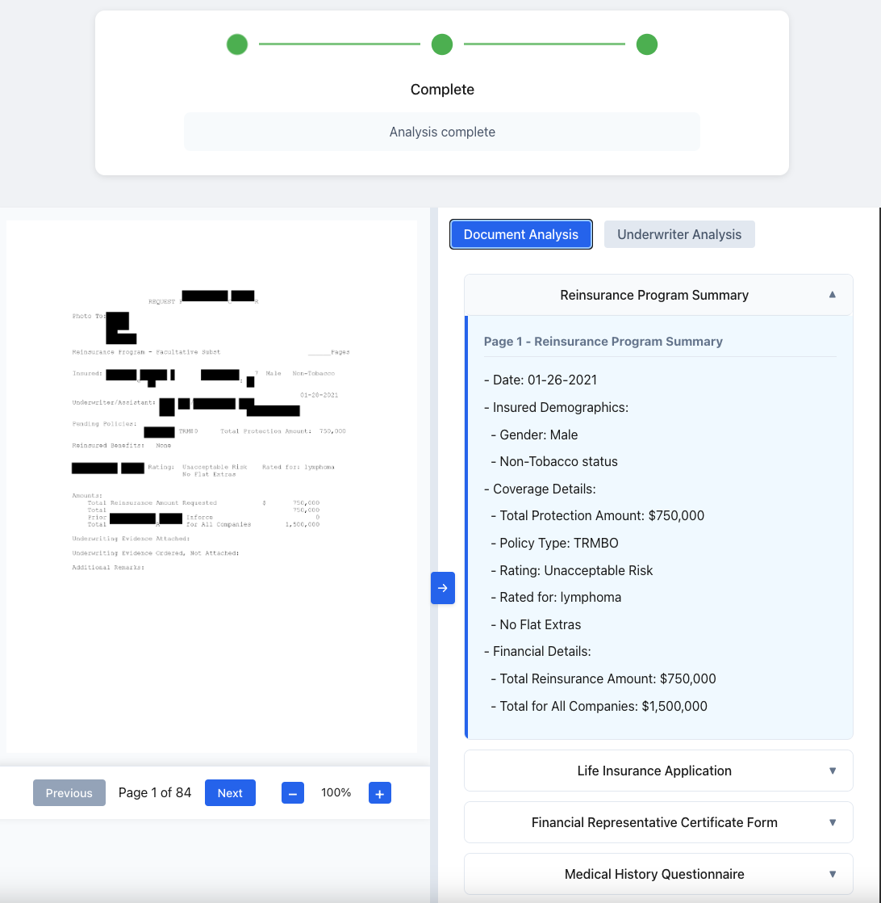
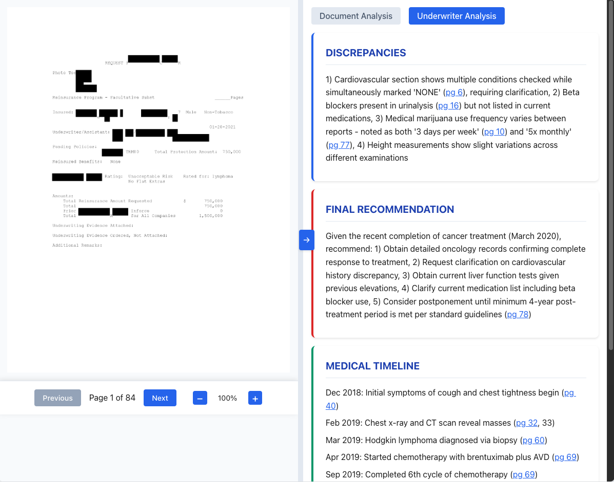
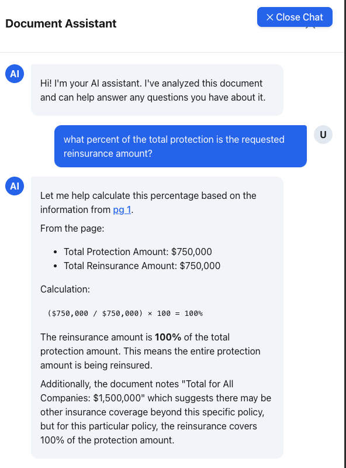
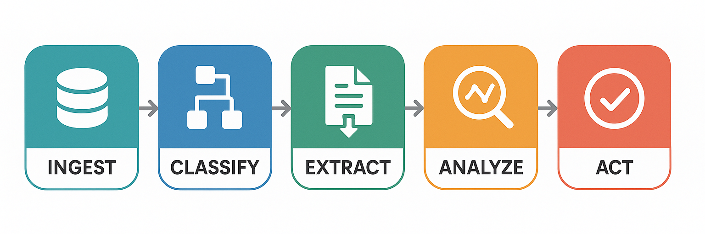

# genai-underwriting-workbench-demo

A demonstration project showcasing the power of Amazon Bedrock and Claude 3.7 Sonnet in transforming life insurance underwriting workflows. 

This solution leverages intelligent document processing to streamline the underwriting process by automatically extracting, analyzing, and making accessible critical information from insurance applications and related documents.

## Table of Contents
- [genai-underwriting-workbench-demo](#genai-underwriting-workbench-demo)
  - [Table of Contents](#table-of-contents)
- [Business Purpose](#business-purpose)
- [Key Features](#key-features)
  - [Document Analysis](#document-analysis)
  - [Underwriter Analysis](#underwriter-analysis)
  - [Chat Interface](#chat-interface)
- [Sample Documents](#sample-documents)
- [Deployment](#deployment)
  - [Prerequisites for Deployment](#prerequisites-for-deployment)
  - [Clone the repository and navigate to the project directory](#clone-the-repository-and-navigate-to-the-project-directory)
  - [Bootstrap and Deploy the CDK Stack](#bootstrap-and-deploy-the-cdk-stack)
- [Technical Overview](#technical-overview)
  - [Demo Workflow](#demo-workflow)
  - [Project Components](#project-components)
  - [Development Setup](#development-setup)
    - [Frontend](#frontend)
  - [Contributors](#contributors)


# Business Purpose

This demo addresses a key challenge in life insurance underwriting: the time-consuming process of reviewing lengthy applications and related documentation. By combining Amazon Bedrock's capabilities with advanced AI models, the solution helps underwriters:

- Reduce time spent on manual document review
- Automatically extract and organize relevant information from complex documents
- Surface key insights and potential risk factors
- Enable natural language interaction with document contents
- Increase consistency in information extraction
- Allow underwriters to focus on decision-making rather than information gathering

# Key Features

## Document Analysis
- Page-by-page analysis of insurance applications and supporting documents
- Efficient batch processing of multiple pages at a time to optimize performance and resource usage
- Intelligent extraction of key data points from each page, enabling comprehensive analysis without token limitations
- Automatic classification of document sections with useful bookmarks



## Underwriter Analysis
- AI-driven analysis of the document to detect discrepancies and extract underwriting-relevant insights
- Evaluation of medical history, medications, and lifestyle factors to identify risk indicators
- Automated identification of potential risk factors and summary of key findings
- Highlighting of areas requiring additional review and cross-referencing of information across sections
- Optional integration with customer's proprietary underwriting manuals for specialized insights



## Chat Interface
- Natural language chat interface for querying document contents
- Context-aware responses leveraging the extracted document insights
- Persistent chat history ensuring coherent conversation flow
- Quick navigation to relevant document sections using markdown links
- Contextual understanding of underwriting terminology for detailed inquiries



## Sample Documents

We have included sample PDF documents in the `sample_documents/` folder. These can be used to test the application's document processing capabilities:
- `life_submission.pdf`: A sample life insurance application.
- `p&c_submission.pdf`: A sample property & casualty insurance application.

# Deployment

The project is designed to be deployed on AWS using the AWS Cloud Development Kit (CDK) for a seamless deployment of both backend and frontend services along with all necessary AWS infrastructure.

## Prerequisites for Deployment

- **Docker**: Required for containerization
  - Install [Docker Desktop](https://www.docker.com/products/docker-desktop/) for your OS
  - Verify the installation by running `docker run hello-world`

- **AWS CLI**: Install and configure with your credentials:
  ```bash
  aws configure  # You'll need access key, secret key, default region (us-east-1 recommended)
  ```

- **Node.js and npm**: Ensure you have Node.js (version 14 or later) and npm installed
  ```bash
  node --version  # Should be >= 14
  npm --version
  ```

- **AWS CDK**: Install globally:
  ```bash
  npm install -g aws-cdk
  cdk --version  # Verify installation
  ```

- **CDK Dependencies**: From the `cdk` directory, install necessary packages:
  ```bash
  cd cdk
  npm install
  ```

## Clone the repository and navigate to the project directory
```bash
git clone https://github.com/aws-samples/sample-genai-underwriting-workbench-demo/
cd sample-genai-underwriting-workbench-demo
```

## Bootstrap and Deploy the CDK Stack

1. If necessary, bootstrap your AWS environment (required once per account/region):
```bash
cd cdk
cdk bootstrap aws://ACCOUNT-NUMBER/REGION  # Replace with your AWS account number and region
```

3. Deploy the stack:
```bash
cdk deploy
```

This process will:
- Create all necessary AWS resources (Lambda functions, Load Balancers, DynamoDB tables, S3 buckets, etc.)
- Deploy backend services and the frontend application
- Output API endpoints and frontend URLs once complete

**Note**: Ensure your AWS account has appropriate permissions to create and manage these resources, including:
- Lambda function creation and management
- DynamoDB table creation
- S3 bucket management
- IAM role and policy management
- CloudFormation full access


# Technical Overview



## Demo Workflow

This demo streamlines the underwriting process through a powerful AI-driven workflow, which can be broken down into four key stages:

1.  **Classify**: Incoming documents are first classified to determine their type (e.g., application, medical report, financial statement). This ensures the correct processing path and relevant extraction models are applied.
2.  **Extract**: Key information and data points are extracted from the classified documents. This includes details like applicant information, medical history, financial data, and other relevant underwriting criteria.
3.  **Analyze**: The extracted data is then analyzed by advanced AI models to identify potential risks, discrepancies, and generate comprehensive underwriting insights. This stage highlights critical information and suggests recommendations.
4.  **Act**: Underwriters can then interact with the analyzed data through a chat interface, review insights, and make informed decisions, leveraging the AI-generated analysis to accelerate their workflow.

## Project Components


The project consists of three main components:

- **Backend**: A serverless backend built with AWS Lambda functions and orchestrated by AWS Step Functions. It leverages Amazon Bedrock and Anthropic's Claude models for intelligent document processing.
  - **API Gateway (api-handler Lambda)**: Handles all API requests, including document uploads (via presigned S3 URLs), retrieving job statuses, and fetching analysis results.
  - **Document Extraction (bedrock-extract Lambda)**: Triggered by new document uploads to S3. It converts PDF documents to images, extracts key-value information from each page using Amazon Bedrock's Claude 3 model, classifies pages, and stores the raw extracted data.
  - **Document Analysis (analyze Lambda)**: Processes the extracted data from the `bedrock-extract` function. It uses Amazon Bedrock's Claude 3.5 Sonnet model to perform comprehensive underwriting analysis, identifying risks, discrepancies, and generating final recommendations.
  - **Agentic Actions (act Lambda)**: Uses the [Strands Agents SDK](https://strandsagents.com/) to perform agentic actions, such as auto declining or requesting additional documentation. 
  - **Orchestration**: AWS Step Functions coordinate the flow between the document upload, extraction, and analysis steps, ensuring a robust and scalable workflow.
  - **Data Storage**: DynamoDB is used to store job metadata, extracted data, and the final analysis results, while S3 is used for raw document storage.

- **Frontend**: A React application (powered by Vite) that provides:
  - Document upload interface with progress tracking
  - Visual representation of extracted information
  - Interactive chat interface for querying document contents
  - Organized display of underwriting insights
  - Seamless document reprocessing capabilities

- **Infrastructure**: Deployed via AWS CDK, which automates the provisioning and management of all cloud resources.

## Development Setup

For local development, follow these steps:

### Frontend
1. Navigate to the frontend directory and install dependencies:
   ```bash
   cd frontend
   npm install
   ```
2. Start the development server:
   ```bash
   npm start
   ```

## Contributors
Thanks to all the contributors for building, reviewing and testing.

[](https://github.com/aws-samples/sample-genai-underwriting-workbench-demo/graphs/contributors)
